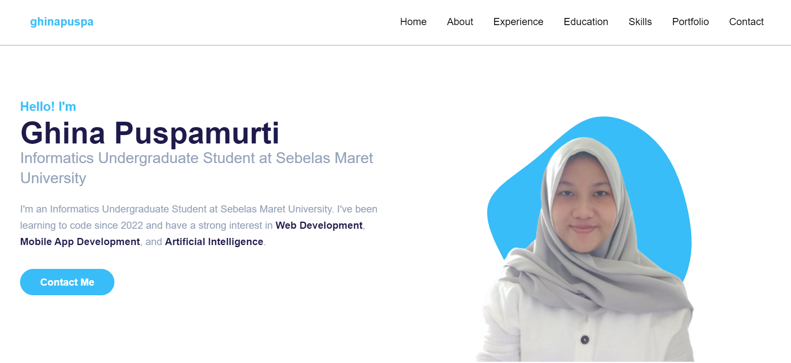
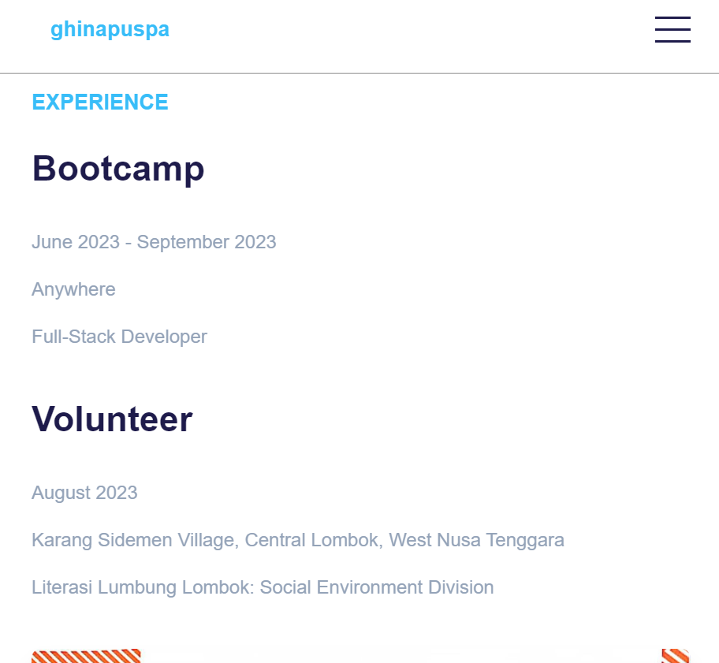
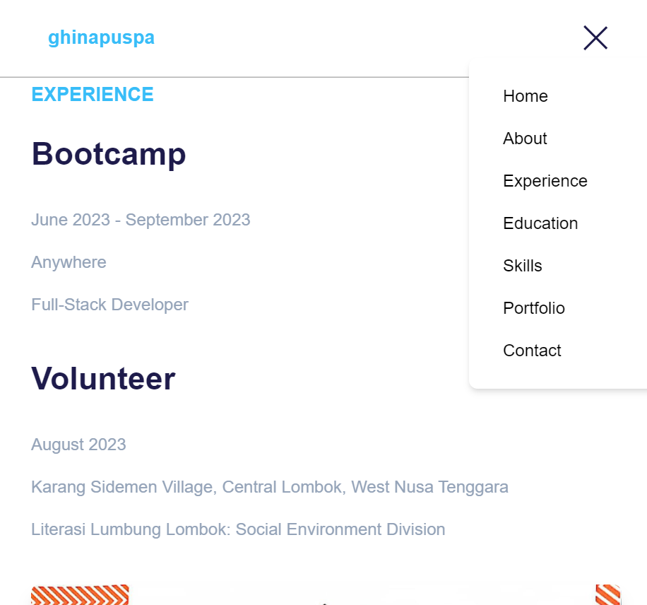

# portfolio

Portfolio Website - Ghina Puspamurti
Fitur-Fitur Tambahan yang Diimplementasikan
Responsiveness:

Website ini dirancang agar responsif pada berbagai ukuran layar, termasuk perangkat mobile, tablet, dan desktop.
Menggunakan grid dan flexbox untuk mengatur tata letak elemen agar tampil optimal pada semua perangkat.
Navigasi Hamburger:

Di perangkat mobile, navigasi utama disembunyikan dalam menu hamburger yang dapat dibuka dengan mengklik tombol.
Navigasi akan berubah menjadi bar horizontal pada layar yang lebih besar.
Transisi dan Animasi:

Animasi hover pada elemen kartu di bagian Skills yang memberikan efek skala untuk menarik perhatian pengguna.
Penggunaan SVG blob sebagai latar belakang yang menambah keindahan visual pada halaman beranda.
Gradient Background:

Penggunaan background gradien pada beberapa elemen seperti kartu Skills untuk menambah estetika modern pada website.
SEO Optimization:

Website telah dioptimalkan untuk SEO dengan menggunakan tag meta dan heading yang sesuai.
Accessible Design:

Semua elemen navigasi dapat diakses menggunakan keyboard dan telah diberi label yang jelas untuk memudahkan aksesibilitas.
Cara Menggunakan Aplikasi
Navigasi Website:

Akses website melalui URL yang telah disediakan.
Pada layar beranda, Anda dapat melihat informasi tentang pengembang dan klik pada tombol Contact Me untuk menghubungi.
Navigasi Menu:

Gunakan menu navigasi di bagian atas untuk berpindah antar halaman seperti About, Experience, Education, Skills, dan Contact.
Pada perangkat mobile, klik tombol hamburger di pojok kanan atas untuk membuka menu navigasi.
Menampilkan dan Menyembunyikan Menu Hamburger:

Pada perangkat mobile, klik tombol hamburger untuk menampilkan menu.
Klik kembali pada tombol hamburger untuk menyembunyikan menu.
Melihat Informasi Pengalaman dan Pendidikan:

Gulir ke bagian Experience untuk melihat pengalaman kerja yang telah dilakukan oleh pengembang.
Gulir ke bagian Education untuk melihat riwayat pendidikan pengembang.
Melihat Keterampilan:

Gulir ke bagian Skills untuk melihat keterampilan yang dimiliki oleh pengembang.
Klik pada setiap kartu untuk melihat lebih dekat informasi keterampilan.
Menghubungi Pengembang:

Di bagian Contact, klik tombol Contact Me untuk mengirim pesan atau email ke pengembang.
Penggunaan Tombol:

Pastikan untuk menggunakan tombol yang disediakan untuk navigasi yang lebih mudah.
Feedback:

Pengguna dapat memberikan masukan melalui bagian kontak untuk pengembangan lebih lanjut.

